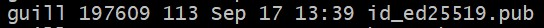

# Manual configurar github por ssh


## Instalación de la clave en Github

- Primero creamos las claves ssh con el siguiente comando:
```bash
    ssh-genkey -t ed25519 -C "tortillaconmayonesa27@gmail.com"
```
- Una vez ejecutado el comando deberiamos tener dos claves, una pública y otra privada:

Clave privada:


Clave pública:



- Mostramos la clave pública y copiamos su contenido mediante el comando:
```bash
    cat ~/.ssh/id_25519.pub
```


- Ahora, desde tu cuenta de GitHub accedemos a los ajustes y, despues, al apartado SSH and GPG keys.


- Ahora le damos a New SSH key. Debe aparecer el siguiente menú en el que debemos poner un título para que sea mas fácil reconocer la clave y donde debemos pegar el contenido del comando anterior.


- Le damos al boton "Add SSH key"


## Añadir la clave a Agent

- El primer paso es iniciar el servicio ssh-agent mediante PowerShell.
- Abrimos una terminal de PowerShell como administrador y escribimos los siguientes comandos:

```bash
    Get-Service ssh-agent | Set-Service -StartupType Automatic
```
```bash
    Start-Service ssh-agent
```


- Debemos añadir la clave al agente para que no la pida cada vez usando los siguientes comandos:

```bash
    eval $(ssh-agent -s)
```
```bash
    ssh-add ~/.ssh/id_25519
```


## Verificar la clave 

- Ahora probamos la conexion con GitHub con el comando:

```bash
    ssh -T git@github.com
```
- Deberia aparecer la siguiente salida del comando:


## Cambiar repositorio de HTTPS A SSH

- Este paso es solo si tu repositorio está configurado con HTTPS. Para cambiarlo hay que seguir estos pasos:
    1. Abrir el repositorio de GitHub.
    2. Hacer clic en el botón verde "Code"
    3. Copiar el contenido del apartado "SSH"


- Posteriormente usamos el siguiente comando para efectuar el cambio:

```bash
    git remote set-url origin git@github.com:Guille2701/Curso_25_26_m.git
```

- hora verificamos que se ha cambiado correctamente:

```bash
    git remote -v
```
- Este comando debe dar una salida similar a la siguiente:


